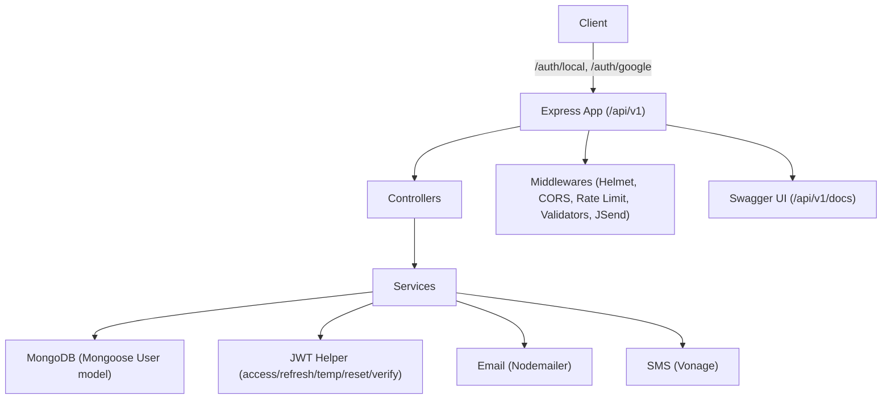

### Authentication & Authorization API

Robust JWT-based authentication with email verification, Google OAuth2, and full two‑factor authentication (SMS, TOTP, backup codes).


## Table of Contents

- [Overview](#overview)
- [Features](#features)
- [Tech Stack](#tech-stack)
- [Architecture](#architecture)
- [Project Structure](#project-structure)
- [Installation](#installation)
- [Usage](#usage)
- [API Documentation](#api-documentation)
- [Environment Variables](#environment-variables)
- [Testing](#testing)
- [Deployment](#deployment)
- [Contributing](#contributing)
- [License](#license)
- [Credits](#credits--acknowledgements)

## Overview

This project provides a production‑ready authentication and authorization API built with Express and Mongoose. It supports local signup with email verification, Google OAuth2, stateless JWT access tokens with refresh token rotation via HttpOnly cookies, and comprehensive two‑factor authentication (SMS, TOTP, backup codes). Requests are validated, rate‑limited, and consistently formatted using JSend. A Swagger UI is included.

## Features

- **Authentication**
  - Local register/login with strong validation (`/api/v1/auth/local`)
  - Email verification flow (`/verify/:verifyToken`)
  - Refresh access token via HttpOnly cookie (`/refresh`)
  - Logout with optional global session invalidation (`/logout?full=true`)
  - Google OAuth2 login (`/api/v1/auth/google`, callback at `/api/v1/auth/google/callback`)
- **Two‑Factor Authentication (2FA)**
  - Setup SMS number (`/api/v1/auth/2fa/setup/sms`)
  - Generate TOTP secret and QR (`/api/v1/auth/2fa/setup/totp`)
  - Verify setup and optionally enable (`POST /api/v1/auth/2fa/setup`)
  - Revoke setup (`PATCH /api/v1/auth/2fa/setup`)
  - Get current status (`GET /api/v1/auth/2fa`)
  - Enable/Disable 2FA (`POST/PATCH /api/v1/auth/2fa`)
  - Regenerate backup codes (`POST /api/v1/auth/2fa/backup-codes`)
  - Send SMS verification code for current or temp auth (`/api/v1/auth/2fa/sms/verify`, `/api/v1/auth/2fa/sms/temp`)
  - Verify during login using temp token (`/api/v1/auth/2fa/verify`)
- **Password Management**
  - Change password (requires auth; 2FA code if enabled) (`PATCH /api/v1/auth/password/change`)
  - Request password reset mail (`POST /api/v1/auth/password/reset`)
  - Reset password with token (`PATCH /api/v1/auth/password/reset/:resetToken`)
- **User**
  - Get authenticated user (`GET /api/v1/users`)
- **Security & Middleware**
  - JWT access/refresh/reset/temp/verify tokens with configurable TTLs
  - Access token in `Authorization: Bearer ...`; refresh token via HttpOnly cookie (`/api/v1/auth` path)
  - Global rate limiting
  - Input validation via `express-validator`
  - Standardized responses via `jsend-middleware`
  - CORS and Helmet enabled
- **Documentation**
  - Swagger UI at `/api/v1/docs`
  - OpenAPI spec in `swagger.yaml`

## Tech Stack

- **Runtime & Framework**
  - Node.js, Express 5.1.0
- **Database**
  - MongoDB, Mongoose 8.15.1
- **Auth**
  - `jsonwebtoken` 9.0.2
  - `passport` 0.7.0, `passport-google-oauth20` 2.0.0
  - `bcrypt` 6.0.0
- **2FA**
  - `speakeasy` 2.0.0 (TOTP)
  - `qrcode` 1.5.4
  - `@vonage/server-sdk` 3.21.2 (SMS)
- **Validation & Security**
  - `express-validator` 7.2.1, `helmet` 8.1.0, `cors` 2.8.5, `express-rate-limit` 7.5.0
- **Email**
  - `nodemailer` 7.0.3
- **Docs**
  - `swagger-ui-express` 5.0.1, `yamljs` 0.3.0
- **Utilities**
  - `jsend-middleware` 1.0.2, `cookie-parser` 1.4.7, `dotenv` 16.5.0
- **Testing**
  - `jest` 30.0.4, `supertest` 7.1.3
- See `package.json` for full versions.

## Architecture

- Client authenticates via local or Google OAuth2.
- Upon local login:
  - If user not verified: verification email is sent.
  - If 2FA enabled: a temp token is issued, and user verifies via SMS/TOTP/backup.
  - Otherwise: access token (JWT) is returned and refresh token is set as HttpOnly cookie.
- Controllers delegate to services; services interact with MongoDB and utilities (JWT, email, SMS).
- Swagger serves API docs.



## Project Structure

```bash
src/
  app.js                    # App wiring: middlewares, routers, Swagger, error handler
  server.js                 # Bootstraps DB and HTTP server
  config/
    env.js                  # Environment variables
    db.js                   # Mongoose connect
    constants.js            # JWT/TFA/bcrypt/rate-limit constants
    passport.js             # Google OAuth strategy
  controllers/              # Route handlers (local, google, password, 2FA, user)
  services/                 # Business logic (local, google, password, 2FA)
  middlewares/              # isAuth, isTempAuth, isValid, rateLimiter, request logger, Swagger
  models/
    user.js                 # User schema with TFA structure and tokens
  routes/                   # /auth (local/google/password/2fa), /users
  utilities/                # JWT, cookies, data helpers, TFA, SMS, email templates
swagger.yaml                # OpenAPI 3.0 spec
```

## Installation

1. Clone and enter the project

```bash
git clone https://github.com/AhmedRedaG/Authentication-Authorization-CAT.git
cd Authentication-Authorization-CAT
```

2. Install dependencies

```bash
npm install
```

3. Create `.env` from the template below and fill in values

```bash
# Environment
NODE_ENV=development
DEVELOPMENT_PORT=3000
TESTING_PORT=3030

# MongoDB
DEVELOPMENT_MONGODB_URI=mongodb://127.0.0.1:27017/auth_dev
TESTING_MONGODB_URI=mongodb://127.0.0.1:27017/auth_test

# JWT secrets
ACCESS_TOKEN_SECRET=replace-with-strong-secret
REFRESH_TOKEN_SECRET=replace-with-strong-secret
RESET_TOKEN_SECRET=replace-with-strong-secret
TEMP_TOKEN_SECRET=replace-with-strong-secret
VERIFY_TOKEN_SECRET=replace-with-strong-secret

# Google OAuth2
GOOGLE_CLIENT_ID=your-google-client-id
GOOGLE_CLIENT_SECRET=your-google-client-secret

# Email (SMTP)
SMTP_HOST=smtp.gmail.com
SMTP_PORT=587
SERVER_MAIL=your-email@example.com
SERVER_MAIL_PASS=your-email-app-password
SUPPORT_MAIL=support@example.com

# Frontend URL for email links
FRONTEND_URL=http://localhost:5173

# SMS (Vonage)
VONAGE_API_KEY=your-vonage-api-key
VONAGE_API_SECRET=your-vonage-api-secret
```

4. Run the development server

```bash
npm run dev
```

- Server: http://localhost:3000
- Docs: http://localhost:3000/api/v1/docs

## Usage

- All responses follow JSend via `jsend-middleware`.
- Send access token in `Authorization: Bearer <accessToken>`.
- Refresh token is stored in an HttpOnly cookie (`refreshToken`) scoped to `/api/v1/auth`.

Example flows:

- Register

```bash
curl -X POST http://localhost:3000/api/v1/auth/local/register \
  -H "Content-Type: application/json" \
  -d '{"name":"Jane Doe","email":"jane@example.com","password":"Password123!","confirmPassword":"Password123!"}'
```

- Verify Email

```bash
curl -X PATCH http://localhost:3000/api/v1/auth/local/verify/<verifyToken>
```

- Login (may return temp token if 2FA enabled)

```bash
curl -X POST http://localhost:3000/api/v1/auth/local/login \
  -H "Content-Type: application/json" \
  -d '{"email":"jane@example.com","password":"Password123!"}'
```

- Refresh Access Token (cookie sent automatically by client)

```bash
curl -X POST http://localhost:3000/api/v1/auth/local/refresh \
  --cookie "refreshToken=<your_refresh_token_cookie_value>"
```

- Logout

```bash
curl -X DELETE http://localhost:3000/api/v1/auth/local/logout
```

- Change Password (requires auth; include `TFACode` if 2FA is enabled)

```bash
curl -X PATCH http://localhost:3000/api/v1/auth/password/change \
  -H "Authorization: Bearer <accessToken>" \
  -H "Content-Type: application/json" \
  -d '{"oldPassword":"OldPassword123!","newPassword":"NewPassword123!","TFACode":"123456"}'
```

- Request Password Reset

```bash
curl -X POST http://localhost:3000/api/v1/auth/password/reset \
  -H "Content-Type: application/json" \
  -d '{"email":"jane@example.com"}'
```

- Reset Password

```bash
curl -X PATCH http://localhost:3000/api/v1/auth/password/reset/<resetToken> \
  -H "Content-Type: application/json" \
  -d '{"password":"NewPassword123!"}'
```

- 2FA: Setup SMS

```bash
curl -X POST http://localhost:3000/api/v1/auth/2fa/setup/sms \
  -H "Authorization: Bearer <accessToken>" \
  -H "Content-Type: application/json" \
  -d '{"phoneNumber":"+1234567890"}'
```

- 2FA: Setup TOTP (returns secret + QR Data URL)

```bash
curl -X POST http://localhost:3000/api/v1/auth/2fa/setup/totp \
  -H "Authorization: Bearer <accessToken>"
```

- 2FA: Verify Setup (and enable immediately)

```bash
curl -X POST http://localhost:3000/api/v1/auth/2fa/setup \
  -H "Authorization: Bearer <accessToken>" \
  -H "Content-Type: application/json" \
  -d '{"method":"sms","TFACode":"123456","enable":true}'
```

- 2FA: Enable (returns backup codes) / Disable

```bash
curl -X POST  http://localhost:3000/api/v1/auth/2fa \
  -H "Authorization: Bearer <accessToken>" \
  -H "Content-Type: application/json" \
  -d '{"method":"totp","TFACode":"123456"}'

curl -X PATCH http://localhost:3000/api/v1/auth/2fa \
  -H "Authorization: Bearer <accessToken>" \
  -H "Content-Type: application/json" \
  -d '{"method":"backup","TFACode":"<backup_code>"}'
```

- 2FA: During Login (temp token)

```bash
# Request SMS during temp auth
curl -X POST http://localhost:3000/api/v1/auth/2fa/sms/temp \
  -H "Authorization: Bearer <tempToken>"

# Verify login
curl -X POST http://localhost:3000/api/v1/auth/2fa/verify \
  -H "Authorization: Bearer <tempToken>" \
  -H "Content-Type: application/json" \
  -d '{"method":"sms","TFACode":"123456"}'
```

## API Documentation

- Swagger UI: `GET /api/v1/docs`
- OpenAPI file: see `swagger.yaml`
- Remote docs (SwaggerHub): [Authentication & Authorization API](https://app.swaggerhub.com/apis-docs/Ahmed-Reda-Freelance/Authentication-Authorization-API/1.0.0)
- Security:
  - Access token: `Authorization: Bearer <accessToken>`
  - Refresh token: `refreshToken` cookie (HttpOnly)

## Environment Variables

Defined in `src/config/env.js`:

- `NODE_ENV`: `development` | `testing` | `production`
- `DEVELOPMENT_PORT`, `TESTING_PORT`: server ports
- `DEVELOPMENT_MONGODB_URI`, `TESTING_MONGODB_URI`: MongoDB URIs
- `ACCESS_TOKEN_SECRET`, `REFRESH_TOKEN_SECRET`, `RESET_TOKEN_SECRET`, `TEMP_TOKEN_SECRET`, `VERIFY_TOKEN_SECRET`: JWT secrets
- `GOOGLE_CLIENT_ID`, `GOOGLE_CLIENT_SECRET`: OAuth2 credentials
- `SMTP_HOST`, `SMTP_PORT`, `SERVER_MAIL`, `SERVER_MAIL_PASS`, `SUPPORT_MAIL`: email configuration
- `FRONTEND_URL`: base URL for verification/reset links
- `VONAGE_API_KEY`, `VONAGE_API_SECRET`: SMS credentials

## Testing

- Run tests:

```bash
npm test
```

- Frameworks: Jest + Supertest
- Tests are located under `__test__/`

Note: The test script sets `NODE_ENV=testing` using Windows syntax.

## Deployment

- Set `NODE_ENV=production` and provide all required environment variables.
- Ensure MongoDB is reachable via the production URI.
- Serve over HTTPS so the refresh token cookie can use `secure: true`.
- Configure allowed OAuth redirect URI to `<your-domain>/api/v1/auth/google/callback`.
- CORS currently uses default settings; consider restricting origins for production.
- Start the app by running `node src/server.js` (or use a process manager like PM2).

## Contributing

- **Issues**: Use GitHub Issues for bugs and feature requests.
- **Pull Requests**:
  - Fork the repo and create a feature branch.
  - Add/adjust tests when changing behavior.
  - Ensure all tests pass.
  - Describe your changes clearly.

## License

ISC — see `package.json` for license metadata.

## Credits & Acknowledgements

- Author: Ahmed Reda
- Libraries: Express, Mongoose, Passport (Google OAuth2), JSON Web Tokens, Speakeasy, QRCode, Vonage SDK, Nodemailer, express-validator, Helmet, CORS, express-rate-limit, jsend-middleware.
- OpenAPI docs via `swagger-ui-express`.
